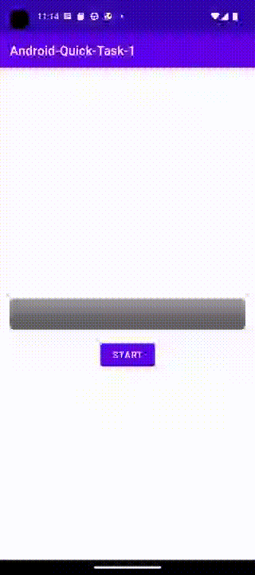

# Android - швидке завдання 1

Реалізуйте додаток з наступним функціоналом:

Додаток містить `ProgressBar` та `Button`. При натисканні на `Button`, `ProgressBar` показує прогрес від 0 до 100 (у прямому чи зворотному напрямку). Приклад роботи додатку:

  

Ви повинні реалізувати додаток за допомогою робочого потоку з використанням настуних механізмів:

- `runOnUiThread`
- `Handler.post()`
- `Handler.sendMessage()`